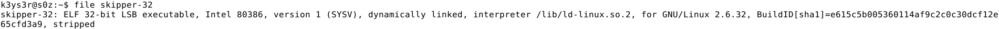
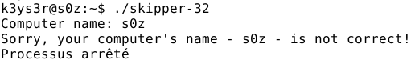
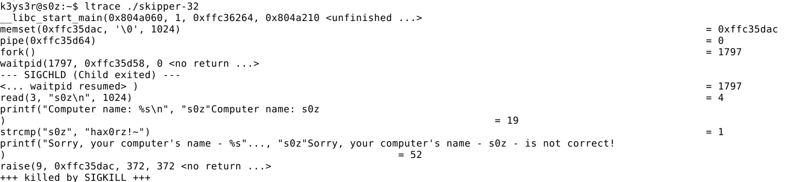
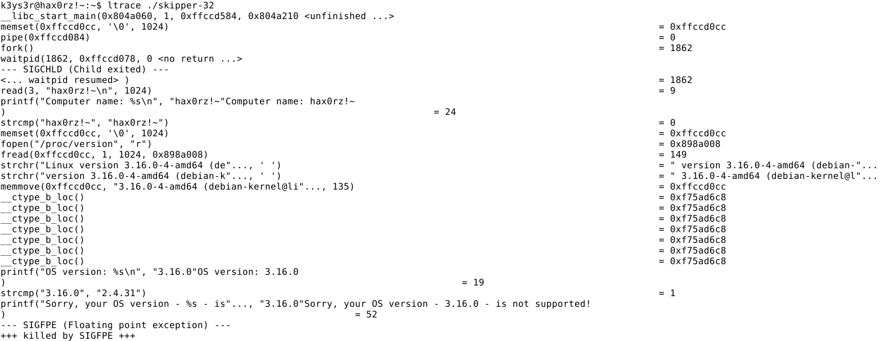
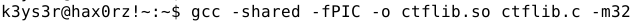
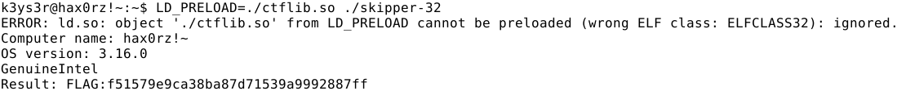

# Skipper

La première chose à faire est de regarder le type du binaire :

On constate que c'est un ELF 32.
On essaie ensuite de l'éxecuter, et on peut voir que le nom du PC ne correspondant à celui qu'attend le programme.

On utilise alors la commande "ltrace", pour peut-être voir quel est le nom d'ordinateur attendu par le binaire :

On voit alors que le nom attendu par le binaire est : hax0rz!
On change alors le nom du PC et réexecute le programme : 

Cette fois on vois que la version de notre kernel n'est pas celle attendu par le programme.
On constate également que le binaire va chercher cette valeur dans "/proc/version". Or il n'est pas possible de modifier ce fichier. Il faut alors trouver un moyen de récupérer le FLAG sans changer cette valeur.
Pour cela, j'ai créé une nouvelle librairie, 'ctflib.c' et y ai ajouté une nouvelle fonction strcmp(), qui renvoie 0 peu importe les valeurs comparées : 

On compile ensuite cette nouvelle librairie (-m32 si le binaire est en 32 bits, sinon rien) : 

Puis on execute le programme en lui indiquant la nouvelle librairie :

Et bingo ! On obtient le flag : **FLAG:f51579e9ca38ba87d71539a9992887ff**
