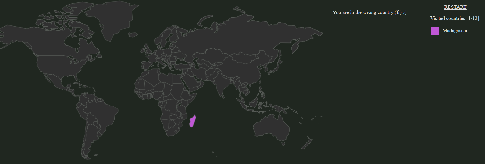
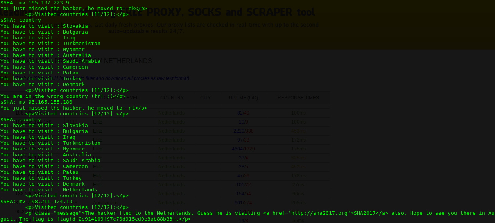

# WEB 150 - Follow Me

This challenge is a worldmap where you have to follow a hacker in random country.

To change the origin country of the request, i use the mozilla firefox add-on "AnonymoX" and saw that the message "you are in the wrong country (fr)" changed by "you are in wrong country (us)". 
So i tried to send a request by adding the header "X-Forwarded-For" and the ip address of a free proxy in the pays where the hacker is.
And thats worked !

So i wrote a  that take 3 commands in input :
  - country : print the country where the hacker is and the number of country to before finding him
  - mv <@ip_proxy> : Add the "X-Forwarded-For" header with the IP specified.
  - restart : Some country don't have free proxy available
  

Then i was able to send request to the site from any country in the world where a free proxy is available.
Below the screenshot of the script running : 

